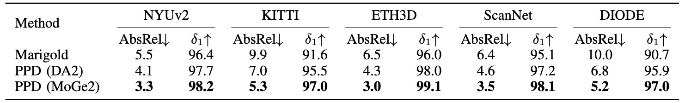

<div align="center">
<h1>Pixel-Perfect Depth</h1>

[**Gangwei Xu**](https://gangweix.github.io/)<sup>1,2,&ast;</sup> · [**Haotong Lin**](https://haotongl.github.io/)<sup>3,&ast;</sup> · Hongcheng Luo<sup>2</sup> · [**Xianqi Wang**](https://scholar.google.com/citations?user=1GCLBNAAAAAJ&hl=zh-CN&oi=ao)<sup>1</sup> · [**Jingfeng Yao**](https://jingfengyao.github.io/)<sup>1</sup>
<br>
[**Lianghui Zhu**](https://scholar.google.com/citations?user=NvMHcs0AAAAJ&hl=zh-CN&oi=ao)<sup>1</sup> · Yuechuan Pu<sup>2</sup> · Cheng Chi<sup>2</sup> · Haiyang Sun<sup>2,&dagger;</sup> · Bing Wang<sup>2</sup> 
<br>
Guang Chen<sup>2</sup> · Hangjun Ye<sup>2</sup> · [**Sida Peng**](https://pengsida.net/)<sup>3</sup> · [**Xin Yang**](https://sites.google.com/view/xinyang/home)<sup>1,&dagger;,✉️</sup>

<sup>1</sup>HUST&emsp; <sup>2</sup>Xiaomi EV&emsp; <sup>3</sup>Zhejiang University  
<br>
&ast;co-first author &emsp; &dagger;project leader &emsp; ✉️ corresponding author

<a href="https://arxiv.org/pdf/2510.07316"></a>
<a href='https://pixel-perfect-depth.github.io/'></a>
<a href='https://huggingface.co/spaces/gangweix/Pixel-Perfect-Depth'></a>
</div>

This work presents Pixel-Perfect Depth, a monocular depth estimation model with pixel-space diffusion transformers. Compared to existing discriminative and generative models, 
its estimated depth maps can produce high-quality, flying-pixel-free point clouds.


  
*Overview of Pixel-Perfect Depth. We perform diffusion generation directly in pixel space without using any VAE.* 

## 🌟 Features

* Pixel-space diffusion generation (operating directly in image space, without VAE or latent representations), capable of producing flying-pixel-free point clouds from estimated depth maps.
* Our model integrates the discriminative representation (ViT) into generative modeling (DiT), fully leveraging the strengths of both paradigms.
* Our network architecture is purely transformer-based, containing no convolutional layers.
* Although our model is trained at a fixed resolution of 1024×768, it can flexibly support various input resolutions and aspect ratios during inference.

## News
- **2026-01-09:** We release the PPVD model together with its weights.
- **2025-12-20:** We release the training code for PPD, featuring a two-stage pipeline: 512×512 pre-training followed by 1024×768 fine-tuning.
- **2025-12-01:** We release a new PPD model together with its weights, which leverage MoGe2 to provide semantics and deliver a 20–30% improvement on zero-shot benchmarks.
- **2025-10-01:** Paper, project page, code, models, and demo are all released.

## Benchmarks


## Pre-trained Models

Our pretrained models are available on the huggingface hub:

| Model | Semantics | Params | Checkpoint | Training Resolution |
|:-|:-|-:|:-:|:-:|
| PPD | DA2 | 500M | [Download](https://huggingface.co/gangweix/Pixel-Perfect-Depth/resolve/main/ppd.pth) | 1024×768 |
| PPD | MoGe2 | 500M | [Download](https://drive.google.com/file/d/1tabmcsbRVDKDfmO4KU1vOjurzN-wp0HV/view?usp=sharing) | 1024×768 |

## Usage

### Prepraration

```bash
git clone https://github.com/gangweix/pixel-perfect-depth
cd pixel-perfect-depth
pip install -r requirements.txt
```

Download our pretrained model [ppd.pth](https://huggingface.co/gangweix/Pixel-Perfect-Depth/resolve/main/ppd.pth) and put it under the `checkpoints/` directory.
In addition, you also need to download the pretrained model [depth_anything_v2_vitl.pth](https://huggingface.co/depth-anything/Depth-Anything-V2-Large/resolve/main/depth_anything_v2_vitl.pth?download=true) (or [moge2.pt](https://huggingface.co/Ruicheng/moge-2-vitl-normal/resolve/main/model.pt?download=true)) and put it under the `checkpoints/` directory.

### Running depth on *images*

```bash
python run.py 
```

### Running point cloud on *images*

Generating point clouds requires metric depth and camera intrinsics from MoGe.
Please download the pretrained model [moge2.pt](https://huggingface.co/Ruicheng/moge-2-vitl-normal/resolve/main/model.pt?download=true) and place it under the `checkpoints/` folder.

```bash
python run_point_cloud.py --save_pcd
```

### Running depth on *video*
Download our pretrained model [ppvd.pth](https://drive.google.com/file/d/1IbMxrljpqkw92Z0G3CVEIrf-JffbI8sN/view?usp=drive_link) and put it under the `checkpoints/` directory. In addition, you also need to download the pretrained model [pi3.safetensors](https://huggingface.co/yyfz233/Pi3/resolve/main/model.safetensors)

```bash
python run_video.py 
```

### Training

Our training strategy follows a two-stage curriculum:

* **Stage 1: Pre-training.** Conducted at 512×512 resolution on the Hypersim dataset.
    ```bash
    python main.py --cfg_file ppd/configs/train_pretrain.yaml pl_trainer.devices=8
    ```
* **Stage 2: Fine-tuning.** Conducted at 1024×768 resolution on a mixture of five datasets.
    ```bash
    python main.py --cfg_file ppd/configs/train_finetune.yaml pl_trainer.devices=8
    ```

## Qualitative Comparisons with Previous Methods

Our model preserves more fine-grained details than Depth Anything v2 and MoGe 2, while demonstrating significantly higher robustness compared to Depth Pro.


## Acknowledgement

We are grateful to the [Depth Anything V2](https://github.com/DepthAnything/Depth-Anything-V2), [MoGe](https://github.com/microsoft/MoGe) and [DiT](https://github.com/facebookresearch/DiT) teams for their code and model release. We would also like to sincerely thank the NeurIPS reviewers for their appreciation of this work (ratings: 5, 5, 5, 5).

## Citation

If you find this project useful, please consider citing:

```bibtex
@article{xu2025pixel,
  title={Pixel-perfect depth with semantics-prompted diffusion transformers},
  author={Xu, Gangwei and Lin, Haotong and Luo, Hongcheng and Wang, Xianqi and Yao, Jingfeng and Zhu, Lianghui and Pu, Yuechuan and Chi, Cheng and Sun, Haiyang and Wang, Bing and others},
  journal={arXiv preprint arXiv:2510.07316},
  year={2025}
}
```
